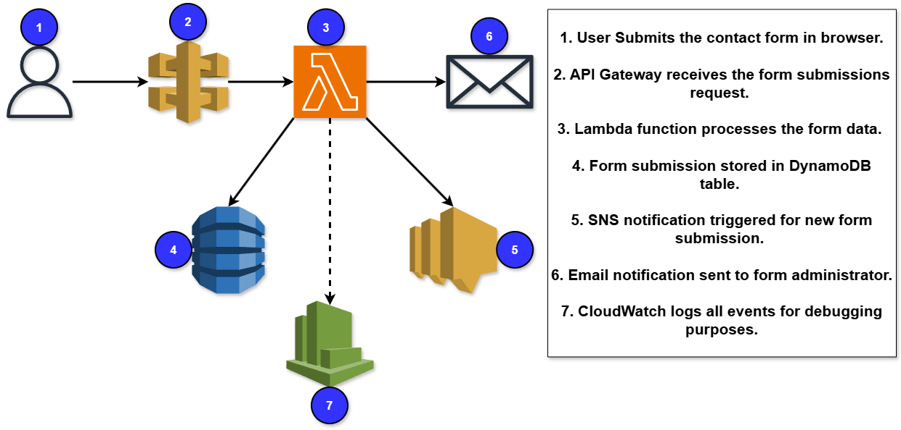

# aws-serverless-debugging-lab
Debugging and restoring a broken AWS serverless contact form workflow using API Gateway, Lambda, DynamoDB, SNS, CloudWatch, and IAM. This project focuses on troubleshooting distributed cloud services, resolving permission issues, analyzing logs, and restoring production functionality.

# Overview of Project

## Scenario

A media company recently reported a critical issue in their production environment. Their contact form, previously working fine, has suddenly stopped sending email notifications and storing messages in their database. This contact form is part of a serverless architecture using:

- Amazon API Gateway  
- AWS Lambda  
- Amazon DynamoDB  
- Amazon SNS  

Since the issue started, the company has missed several important client messages, risking customer trust and reputation.

---

## Our Solution

We’ll take the role of a **Cloud Support Engineer** and investigate the broken serverless workflow.

Using AWS tools such as:

- Amazon CloudWatch  
- AWS IAM  
- AWS Console  

We will diagnose the issue by tracing the flow of data and identifying where the failure occurs. After identifying the root cause, we’ll apply fixes to restore full functionality, ensuring that:

- Form submissions are successfully stored in DynamoDB  
- Email notifications are properly sent through SNS  

---

## About Project

As a Cloud Support Engineer, your responsibility is to identify and resolve issues in production serverless workflows.

In this project, I simulate a real-world support ticket by investigating a broken contact form integration. You’ll:

- Explore CloudWatch logs for Lambda functions
- Verify API Gateway configuration
- Review IAM permissions and policies
- Check DynamoDB table functionality
- Validate SNS subscription health

---

# 👩‍💻 Steps to be Performed
In the next few lessons, I will complete the following tasks:

1. Deploy the Broken CloudFormation Stack  
2. Reproduce the Contact Form Issue  
3. Investigate the Lambda Logs  
4. Trace and Verify the Full Architecture  
5. Apply Fixes to Restore Functionality  
6. Write a Professional Support Response  

---

# 🛠 Services Used
| AWS Service | Purpose |
|---|---|
| Amazon API Gateway | Exposes the contact form as an HTTP endpoint |
| AWS Lambda | Handles incoming form submissions |
| Amazon DynamoDB | Stores user-submitted form data |
| Amazon SNS | Sends email notifications to the support team |
| Amazon CloudWatch | Monitors Lambda execution and logs errors |
| AWS IAM | Controls permissions between AWS services |

---

# ➡️ Diagram
This is the architectural diagram for the project.

### Screenshot

---

# ✅ Final Result

A fully functional serverless contact form workflow that demonstrates:

- Smooth integration between API Gateway, Lambda, DynamoDB, and SNS  
- End-to-end debugging using CloudWatch Logs  
- Fixing permission issues and SNS subscription confirmation problems  
- Writing a professional support response documenting the root cause and resolution  

This project gives you hands-on troubleshooting experience across multiple AWS services — essential knowledge for any Cloud Support Engineer working in a production support role.
