# aws-serverless-debugging-lab

Debugging and restoring a broken AWS serverless contact form workflow using API Gateway, Lambda, DynamoDB, SNS, CloudWatch, and IAM.

This project focuses on troubleshooting distributed cloud services, resolving IAM permission issues, analyzing CloudWatch logs, identifying Lambda runtime failures, and restoring full production functionality within a serverless AWS architecture.

---

# Overview of Project

## Scenario

A media company recently reported a critical issue in their production environment. Their contact form, which previously worked correctly, suddenly stopped:

- Sending email notifications
- Storing customer submissions in the database

The contact form is built using a serverless AWS architecture consisting of:

- Amazon API Gateway
- AWS Lambda
- Amazon DynamoDB
- Amazon SNS

As a result of the outage, the company missed several important client messages, creating operational risk and negatively impacting customer trust.

---

# Our Solution

In this project, I take the role of a Cloud Support Engineer responsible for investigating and restoring the broken serverless workflow.

Using AWS services and troubleshooting tools such as:

- Amazon CloudWatch
- AWS IAM
- AWS Management Console

I traced the full request flow, identified the root causes, and applied fixes to restore functionality across the environment.

The final solution successfully restored:

```bash
✓ DynamoDB form submission storage
✓ SNS email notifications
✓ End-to-end serverless workflow functionality
```

---

# About the Project

As a Cloud Support Engineer, my responsibility is to diagnose and resolve issues affecting production cloud workloads.

In this project, I simulated a real-world support investigation by troubleshooting a broken contact form integration and validating communication between multiple AWS services.

During the investigation, I:

- Explored CloudWatch Logs for Lambda execution errors
- Verified API Gateway configuration and integrations
- Reviewed IAM permissions and policies
- Validated DynamoDB table functionality
- Confirmed SNS subscription health
- Applied fixes and re-tested the complete workflow

---

# Steps Performed

Throughout this project, I completed the following tasks:

```bash
1. Deploy the Broken CloudFormation Stack
2. Reproduce the Contact Form Issue
3. Investigate Lambda Logs
4. Trace and Verify the Full Architecture
5. Apply Fixes to Restore Functionality
6. Validate End-to-End Workflow Recovery
7. Document Root Cause and Resolution
```

---

# Services Used
| AWS Service | Purpose |
|---|---|
| Amazon API Gateway | Exposes the contact form as an HTTP endpoint |
| AWS Lambda | Handles incoming form submissions |
| Amazon DynamoDB | Stores user-submitted form data |
| Amazon SNS | Sends email notifications to the support team |
| Amazon CloudWatch | Monitors Lambda execution and logs errors |
| AWS IAM | Controls permissions between AWS services |

---

# Diagram
This is the architectural diagram for the project.

### Screenshot


---

# Final Result

A fully functional serverless contact form workflow that demonstrates:

- Smooth integration between API Gateway, Lambda, DynamoDB, and SNS  
- End-to-end debugging using CloudWatch Logs  
- Fixing permission issues and SNS subscription confirmation problems  
- Writing a professional support response documenting the root cause and resolution  

This project gave me hands-on troubleshooting experience across multiple AWS services — essential knowledge for any Cloud Support Engineer working in a production support role.

---

# 4.2 Deploying the Broken CloudFormation Stack

## Introduction

In this section, I will deploy a CloudFormation stack containing intentionally broken serverless components. This setup simulates a real-world troubleshooting scenario where a production contact form workflow is failing.

The stack will create the following AWS resources:

- Amazon API Gateway
- AWS Lambda
- Amazon DynamoDB
- Amazon SNS
- AWS IAM Roles

The environment is intentionally misconfigured so we can investigate and resolve the issues throughout the lab.

---

# Step 1: Creating the CloudFormation Stack

### 1. Download the CloudFormation Template

I would download the template file:

```bash
Broken-contact-form.yml
```

### Screenshot

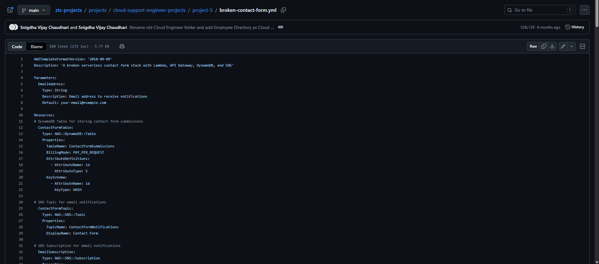

---

### 2. Navigate to AWS CloudFormation

1. I will open the AWS Console
2. Search for **CloudFormation**
3. Open the CloudFormation service dashboard

### Screenshot
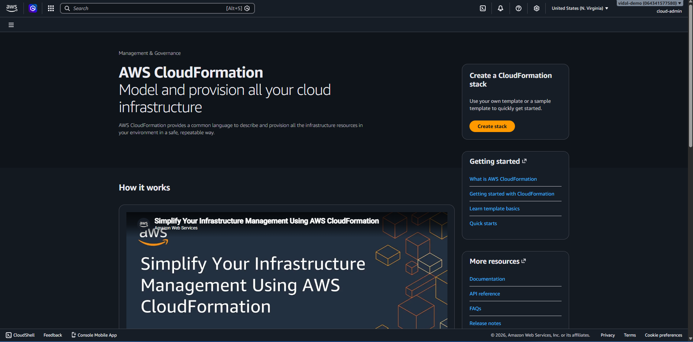

---

### 3. Create the Stack

1. Click **Create stack**
2. Select **Choose an existing template**
3. Upload the YAML template file
4. Click **Next**

### Screenshot

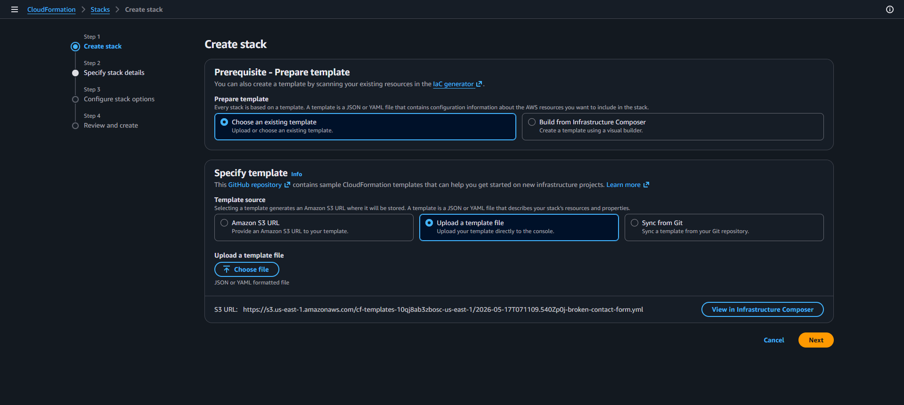

---

# Step 2: Specify Stack Details

### Configure Stack Name

I would enter the following stack name:

```bash
broken-contact-form
```

### Configure Parameters

Under the **EmailAddress** parameter:

- I Replaced the default value with my personal email address

```bash
jorgev192@gmail.com
```

This email address will later receive SNS notifications from the contact form system. 

### Screenshot

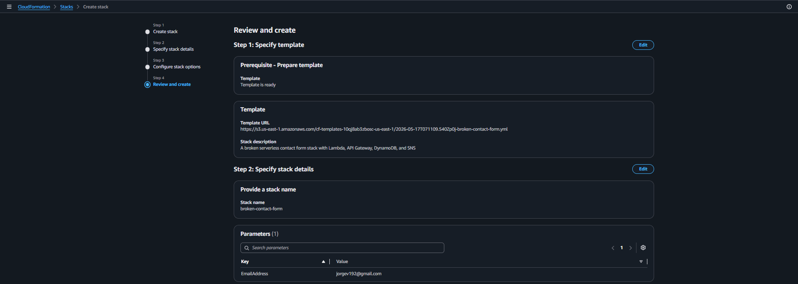

---

# Step 3: Configure Stack Options

### Review Stack Configuration

1. I would leave all default settings unchanged
2. Scroll to the **Capabilities** section
3. Check the acknowledgment box:

```text
I acknowledge that AWS CloudFormation might create IAM resources with custom names
```

### Why This Matters

The CloudFormation template creates IAM roles that allow Lambda to interact with other AWS services. However, the permissions are intentionally incomplete and will later require troubleshooting.

### Screenshot

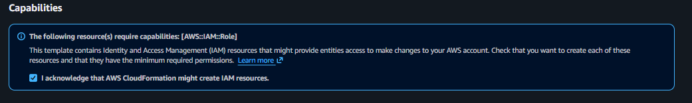

---

# Step 4: Review and Create Stack

### Deploy the Stack

1. Review all stack configuration details
2. Click **Submit**
3. Wait for deployment to begin

### Screenshot
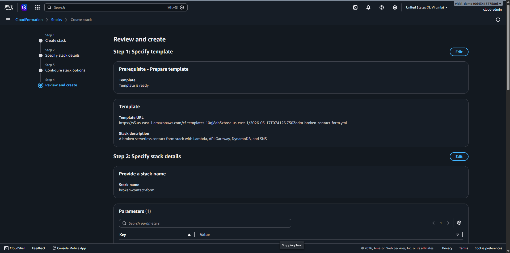

---

# Understanding the CloudFormation Template

The YAML template defines a complete serverless contact form architecture.

### Resources Created

| Resource | Purpose |
|---|---|
| API Gateway | Receives HTTP form submissions |
| AWS Lambda | Processes contact form requests |
| DynamoDB | Stores submitted messages |
| SNS Topic | Sends notification emails |
| IAM Role | Controls Lambda permissions |

### Important Note

The environment contains intentional issues including:

- Missing IAM permissions
- Unconfirmed SNS subscriptions
- Faulty Lambda logic

These problems will be diagnosed and fixed later in the project.

---

# Step 5: Monitor Stack Creation Progress

### Verify Deployment Status

1. I then Navigate to the **Events** tab
2. And Monitor resource creation progress
3. I Wait until the stack status changes to:

```bash
CREATE_COMPLETE
```

### Screenshot
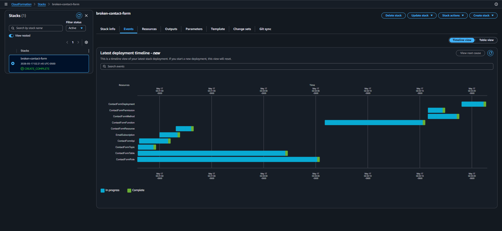

---

# Step 6: Collect Stack Outputs

Once deployment completes:

1. I then open the **Outputs** tab
2. Record the following values:

| Output | Description |
|---|---|
| ApiUrl | Contact form API endpoint |
| LambdaFunction | Lambda function name |
| DynamoDBTable | DynamoDB table name |
| SNSTopic | SNS Topic ARN |

These values will be recorded throughout the troubleshooting process. 

### Screenshot
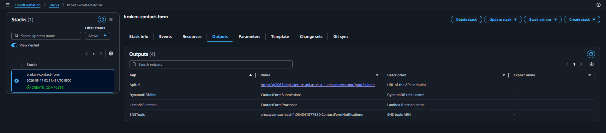

---

# Step 7: Verify Email Subscription

### SNS Subscription Confirmation

1. I would then check my inbox
2. Locate the AWS notification email
3. Subject line:

```text
AWS Notification - Subscription Confirmation
```

### Screenshot
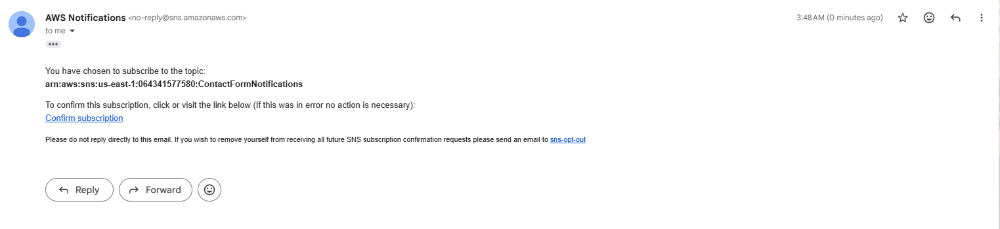

---

# Step 8: Verify AWS Resources

## Check Lambda Function

1. Open the AWS Lambda Console
2. Locate the function:

```bash
ContactFormProcessor
```

3. Review:
   - Function code
   - Execution role
   - Permissions
   - Environment variables

### Screenshot
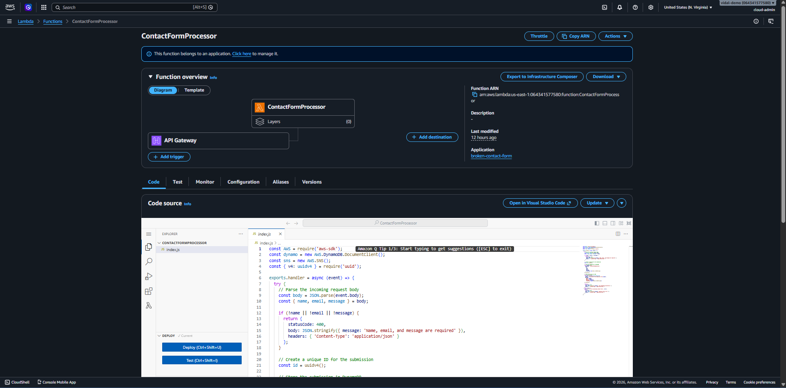

---

## Check DynamoDB Table

1. Open DynamoDB Console
2. Navigate to **Tables**
3. Locate:

```bash
ContactFormSubmissions
```

4. Verify the table is empty

### Screenshot

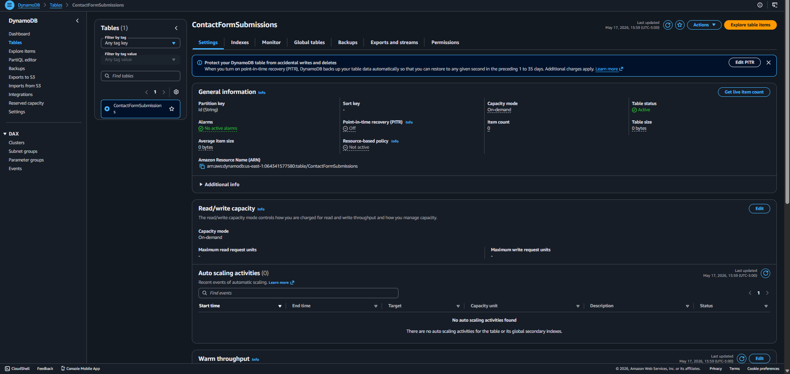

---

## Check SNS Topic

1. Open Amazon SNS Console
2. Navigate to **Topics**
3. Locate:

```bash
ContactFormNotifications
```

4. Review the email subscription

### Screenshot

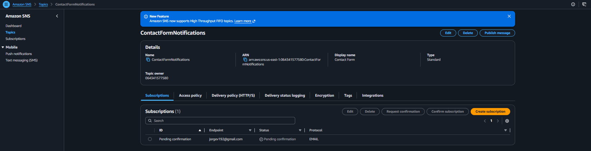

---

## Check API Gateway

1. Open API Gateway Console
2. Locate:

```bash
ContactFormApi
```

3. Verify:
   - `/submit` resource exists
   - POST method is configured

### Screenshot

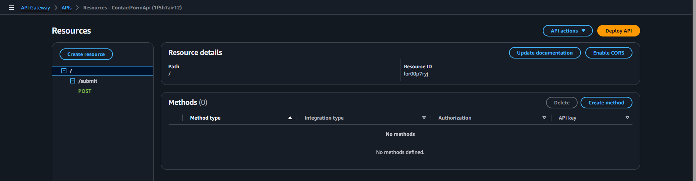

---

# Understanding the Broken Components

The deployed architecture contains several intentional issues.

## 1. Missing IAM Permissions
The Lambda function lacks permissions to:

- Write to DynamoDB
- Publish messages to SNS

Without the correct IAM policies, services cannot communicate successfully.

---

## 2. Unconfirmed SNS Subscription
SNS email subscriptions require manual confirmation before notifications can be delivered.

---

## 3. Lambda Code Issues
The Lambda function contains logic errors that may prevent proper execution even if permissions are corrected. 

---

# Next Steps
With the broken CloudFormation stack successfully deployed, the environment is now ready for troubleshooting.

In the next section, I will:
- Reproduce the contact form issue
- Test the API endpoint
- Investigate failures using CloudWatch Logs
- Begin identifying the root cause

---

# ☁️ 4.3 Reproducing and Documenting the Contact Form Issue

## Introduction

In this section, I tested the deployed serverless infrastructure to reproduce and document the issues affecting the contact form workflow.
As part of the troubleshooting process, I needed to confirm exactly how the system was failing before attempting any fixes. I used AWS services such as API Gateway, DynamoDB, Lambda, and CloudWatch to trace the request flow and identify where the failures occurred. 

---

# Step 1: Accessing API Gateway

To begin troubleshooting, I first verified that the API Gateway configuration was correctly connected to the Lambda function.

## Actions Performed

1. Opened the AWS Management Console
2. Searched for **API Gateway**
3. Opened the API named:

```bash
ContactFormApi
```

4. Navigated to:

```bash
Resources → /submit → POST
```

5. Verified that the POST method was integrated with the Lambda function

This confirmed that API Gateway was successfully configured to forward requests to Lambda.

---

## Verified API Endpoint

I also checked the **Stages** section and confirmed that the **Invoke URL** matched the API URL generated from the CloudFormation outputs.

### Screenshot
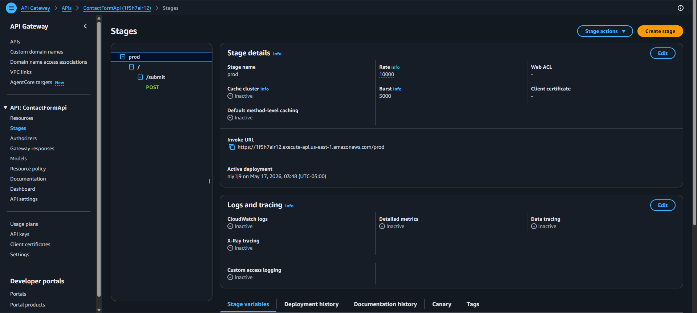

---

# Step 2: Testing the Contact Form API

Next, I used the built-in API Gateway test feature to simulate a contact form submission.

## Request Body Used

```json
{
  "name": "Test User",
  "email": "test@example.com",
  "message": "This is a test message from API Gateway console"
}
```

The Lambda function expected these exact fields:

- name
- email
- message

---

## Running the Test

After entering the JSON payload:

1. I clicked the **Test** button
2. Waited for the API response
3. Reviewed the returned status code and response body

### Screenshot
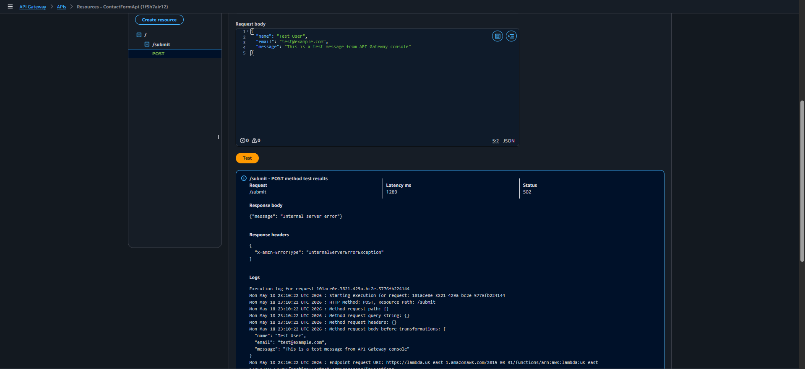

---

# Step 3: Documenting the API Response

After testing the API, I documented the results to better understand the failure.

## Test Results

```bash
Status Code: 502
Response Body: {"message":"Internal server error"}
Request Duration: 1289 ms
```

## Observations

- The API returned an internal server error
- The request successfully reached API Gateway
- The failure likely occurred during Lambda execution

This suggested that the backend processing layer was encountering issues.

### Screenshot
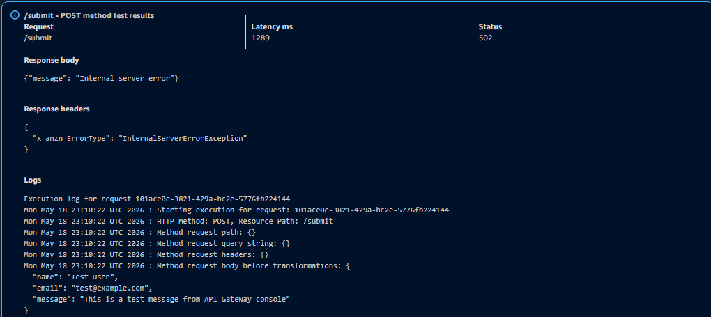

---

# Step 4: Verifying DynamoDB Entries

Next, I checked whether the contact form data was successfully stored in DynamoDB.

## Actions Performed

1. Opened the DynamoDB Console
2. Navigated to:

```bash
Tables → ContactFormSubmissions
```

3. Opened:

```bash
Explore table items
```

4. Checked for newly created records

---

## Findings

I did not see any new records inside the table.

This confirmed that the Lambda function failed to write data into DynamoDB.

### Screenshot
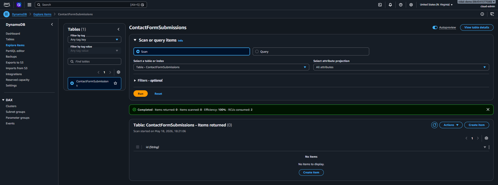

---

# Step 5: Checking SNS Email Notifications

After testing DynamoDB, I verified whether Amazon SNS successfully delivered email notifications.

## Actions Performed

1. Checked my inbox and spam folder
2. Looked for AWS SNS notification emails related to the test message

---

## Findings

No notification emails were received after submitting the contact form.

This confirmed that the SNS notification workflow was also failing.

---

# Step 6: Verifying Lambda Function Invocation

To confirm whether API Gateway successfully triggered Lambda, I inspected the Lambda monitoring metrics.

## Actions Performed

1. Opened the AWS Lambda Console
2. Selected the function:

```bash
ContactFormProcessor
```

3. Opened the **Monitor** tab
4. Reviewed invocation metrics and CloudWatch Logs

---

## Findings

I confirmed that:

- API Gateway successfully invoked the Lambda function
- Lambda execution was failing during runtime
- CloudWatch Logs contained execution errors

This narrowed the issue down to the Lambda layer instead of API Gateway configuration.

### Screenshot
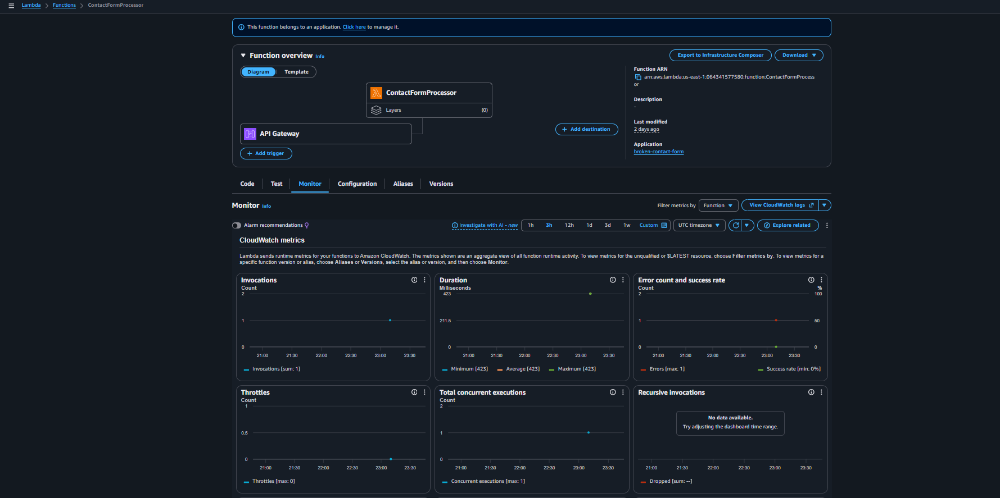

---

# Step 7: Recording All Symptoms

After completing testing across all services, I compiled the following observations.

## Contact Form Issue Symptoms

```bash
1. API Gateway returned a 502 Internal Server Error
2. No new DynamoDB entries were created
3. No SNS email notifications were received
4. API Gateway configuration appeared correct
5. Lambda function was triggered but failed during execution
```
---

# Step 8: Formulating Initial Hypotheses

Based on the symptoms observed, I developed several possible explanations for the failures.

## Potential Root Causes

```bash
1. Lambda function may have insufficient IAM permissions
2. SNS subscription may not be configured correctly
3. Lambda function may contain code issues
4. Environment variables may be incorrectly configured
```

Creating hypotheses helped guide the troubleshooting process systematically instead of relying on random trial and error.

---

# Next Steps

With the contact form issues successfully reproduced and documented, the next step will be to investigate the Lambda function logs using Amazon CloudWatch.

This will help identify the exact runtime errors causing the workflow failures.

---

# 4.4 Investigating Lambda Logs

## Introduction

In this section, I investigated the AWS Lambda function logs to identify the root causes of the contact form failures.

Using Amazon CloudWatch Logs, I analyzed the Lambda execution behavior and reviewed runtime errors, permission issues, and configuration problems affecting the serverless workflow. This process is a critical troubleshooting skill for Cloud Support Engineers working with AWS serverless environments.

---

# Step 1: Accessing the Lambda Function

To begin the investigation, I opened the Lambda function responsible for processing contact form submissions.

## Actions Performed

1. Opened the AWS Management Console
2. Searched for **Lambda**
3. Selected the function:

```bash
ContactFormProcessor
```

4. Reviewed the Lambda function configuration page

### Screenshot
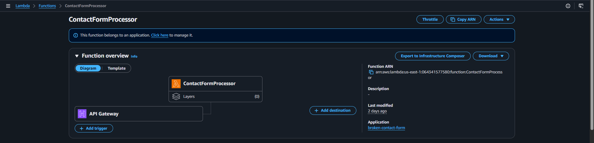

---

# Step 2: Reviewing Lambda Function Code

Next, I reviewed the Lambda function source code to better understand how the application processed requests.

## Findings

While reviewing the code, I identified several important components:

- The function used the AWS SDK to interact with DynamoDB and SNS
- The code referenced:

```javascript
require('uuid')
```

- Environment variables were used for SNS topic configuration
- Error handling logic was implemented within the function

The `uuid` dependency immediately stood out as a possible source of failure if it was missing from the deployment package. 

### Screenshot

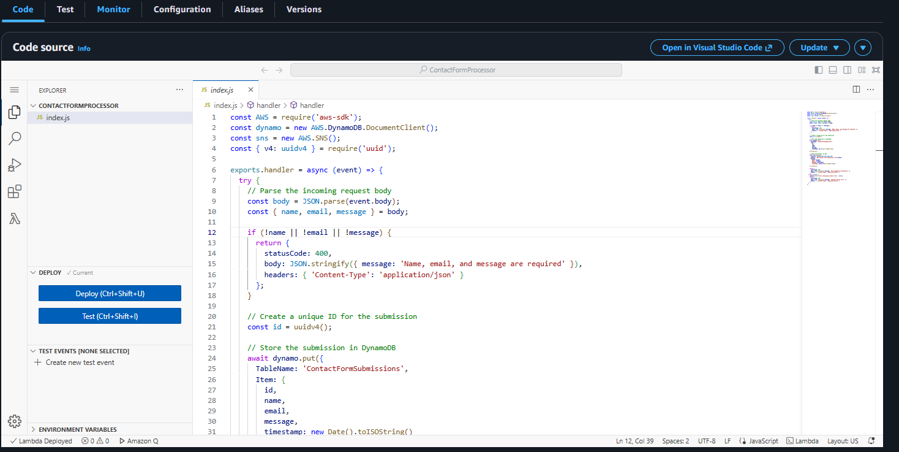


---

# Step 3: Checking Environment Variables

I then verified the Lambda environment variable configuration.

## Actions Performed

1. Opened the **Configuration** tab
2. Navigated to:

```bash
Environment Variables
```

3. Verified the following variable existed:

```bash
SNS_TOPIC_ARN
```

## Findings

The environment variable was configured correctly and contained the ARN for the SNS topic.

This confirmed that the issue was likely unrelated to missing environment variables.

### Screenshot
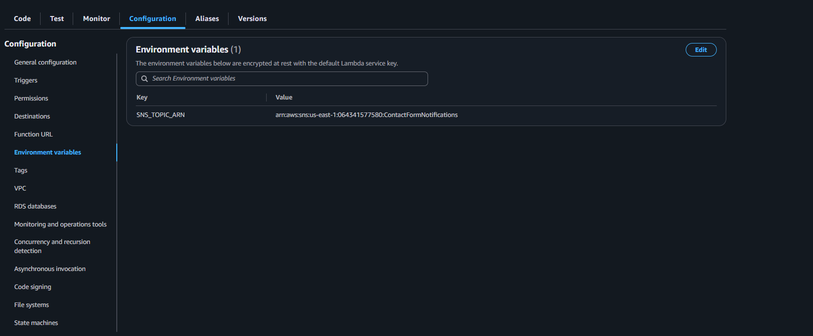

---

# Step 4: Reviewing Lambda Execution Role Permissions

Next, I investigated the IAM permissions assigned to the Lambda function.

## Actions Performed

1. Opened the **Permissions** section
2. Reviewed the Lambda execution role
3. Opened the IAM role attached to the function

---

## Findings

I observed that the Lambda function only had the following managed policy attached:

```bash
AWSLambdaBasicExecutionRole
```

This policy only grants permissions to write logs to CloudWatch.

I also confirmed the role was missing permissions for:

- DynamoDB
- SNS publishing

This indicated that the Lambda function would fail when attempting to:

- Write records into DynamoDB
- Publish SNS notifications

### Screenshot
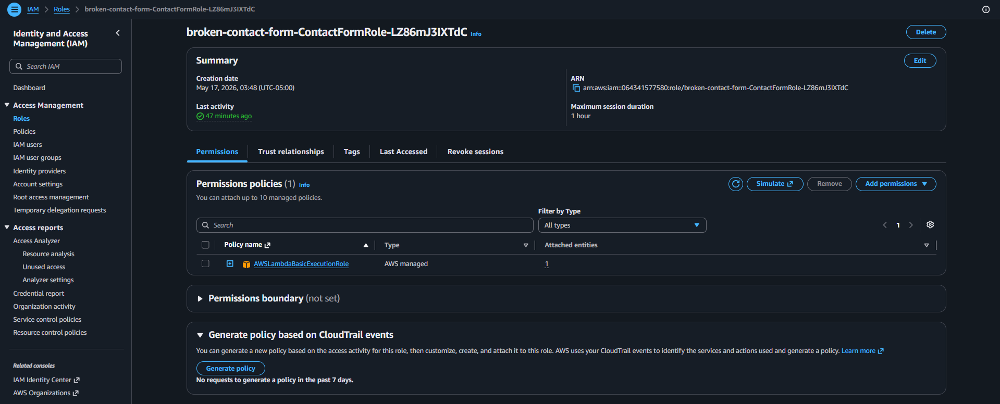

---

# Step 5: Accessing CloudWatch Logs

To investigate runtime failures, I accessed the Lambda execution logs in Amazon CloudWatch.

## Actions Performed

1. Opened the **Monitor** tab
2. Clicked:

```bash
View CloudWatch Logs
```

3. Opened the log group:

```bash
/aws/lambda/ContactFormProcessor
```

4. Selected the most recent log stream generated from my API test request

### Screenshot
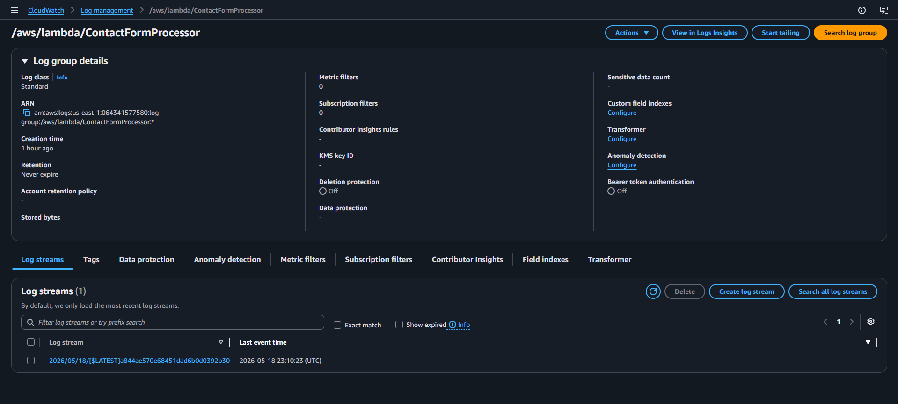

---

# Step 6: Identifying Error Messages

Inside the CloudWatch logs, I identified several important execution errors.

## Error 1 — Missing Dependency

```bash
Error: Cannot find module 'uuid'
```

### Impact

The Lambda function attempted to import the `uuid` package, but the dependency was missing from the deployment package.

This caused the function to fail during initialization before processing the request fully.

---

## Error 2 — DynamoDB Permission Issue

```bash
AccessDeniedException:
not authorized to perform dynamodb:PutItem
```

### Impact

The Lambda execution role lacked permission to write records into DynamoDB.

---

## Error 3 — SNS Permission Issue

```bash
AccessDeniedException:
not authorized to perform sns:Publish
```

### Impact

The Lambda execution role also lacked permission to publish messages to Amazon SNS.

---

# Step 7: Documenting the Errors

After reviewing the CloudWatch logs, I documented the identified issues.

## Lambda Execution Errors

```bash
## Lambda Execution Errors

1. Error: Cannot find module 'uuid'
   - Operation: Creating unique ID for form submission
   - Service: AWS Lambda dependency initialization
   - Timestamp: 2026-05-18T23:10:23.623Z
   - Impact: BLOCKING ERROR - Prevents Lambda function initialization

2. Runtime.ImportModuleError
   - Operation: Loading Lambda function modules
   - Service: AWS Lambda Runtime
   - Timestamp: 2026-05-18T23:10:23.623Z
   - Impact: Lambda execution failed before processing the request

3. INIT_REPORT Status: error
   - Operation: Lambda initialization phase
   - Service: AWS Lambda Runtime Environment
   - Timestamp: 2026-05-18T23:10:23.649Z
   - Impact: Function initialization terminated due to missing dependency

4. Require stack:
   - /var/task/index.js
   - /var/runtime/index.mjs
   - Service: AWS Lambda Runtime
   - Impact: Confirms the missing module originated from the Lambda application code
```

These findings confirmed that the serverless workflow failures were caused by both dependency issues and IAM permission misconfigurations.

### Screenshot
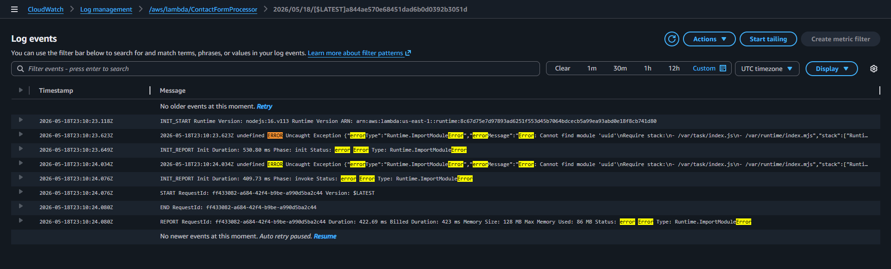

---

# Step 8: Updating My Troubleshooting Hypotheses

Based on the CloudWatch investigation, I refined my original troubleshooting hypotheses.

## Confirmed Issues

```bash
1. Missing Lambda dependency: uuid package not found
2. Runtime.ImportModuleError during Lambda initialization
3. Lambda function failed before request processing completed
```

## Potential Issues (Not Yet Confirmed)

```bash
1. Possible missing DynamoDB write permissions
2. Possible missing SNS publish permissions
3. Additional runtime issues may appear after resolving the dependency error
```

## Additional Notes

The environment variable configuration appeared correct, which helped narrow the issue down to:

- Lambda packaging
- IAM permissions

---

# Next Steps

With the Lambda errors successfully identified, the next phase of the investigation will focus on tracing and verifying the full serverless architecture.

This includes:

- Verifying service integrations
- Confirming IAM trust relationships
- Inspecting API Gateway integrations
- Validating SNS and DynamoDB connectivity

---

# ☁️ 4.5 Tracing and Verifying the Full Architecture

## Introduction

In this section, I performed a full end-to-end analysis of the serverless architecture to identify every point of failure affecting the contact form workflow.

By systematically reviewing each AWS service and verifying how they interacted with one another, I was able to build a complete picture of the architecture and identify the configuration, dependency, and permission issues preventing the application from functioning correctly.
---

# Step 1: Reviewing the Serverless Architecture

Before troubleshooting each service individually, I mapped out how the architecture was expected to function.

## Expected Workflow

```bash
1. Client submits form data to API Gateway
2. API Gateway forwards the request to Lambda
3. Lambda processes the request
4. Lambda writes form data into DynamoDB
5. Lambda publishes a notification to SNS
6. SNS sends an email notification to subscribers
```

This helped me identify every stage where failures could occur within the workflow.

### Screenshot
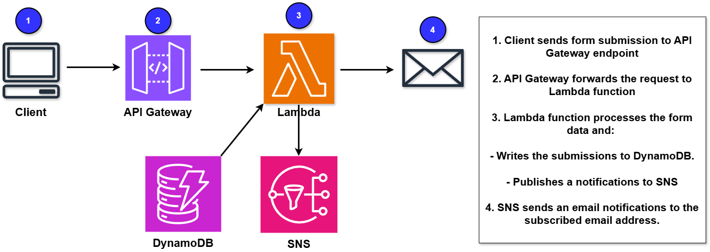

---

# Step 2: Verifying API Gateway Configuration

I first verified that API Gateway was properly configured and correctly integrated with Lambda.

## Actions Performed

1. Opened the API Gateway Console
2. Selected:

```bash
ContactFormApi
```

3. Verified:
   - `/submit` resource existed
   - POST method existed
   - Integration type was set to Lambda Function
   - Lambda target was `ContactFormProcessor`

---

## Method Request Verification

I also reviewed the Method Request configuration and confirmed:

- Authorization = NONE
- No API key required
- No request validators enabled

This confirmed the API endpoint was publicly accessible and properly configured.

### Screenshot
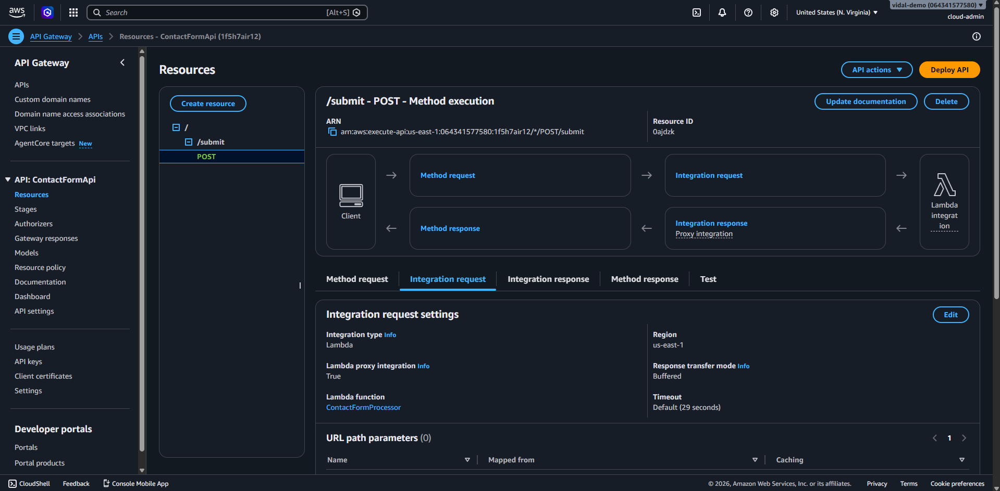

---

## API Deployment Verification

Next, I reviewed the deployment stage configuration.

## Findings

- Verified the `prod` stage existed
- Confirmed the API was successfully deployed
- Verified the Invoke URL matched the CloudFormation outputs

### Screenshot
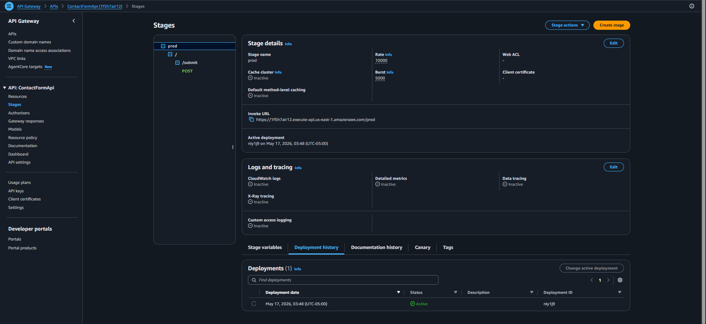

---

# Step 3: Verifying DynamoDB Configuration

Next, I reviewed the DynamoDB table configuration used for storing contact form submissions.

## Table Verification

I verified the following table settings:

```bash
Table Name: ContactFormSubmissions
Table Status: Active
Primary Key: id (String)
Capacity Mode: On-demand
```

These settings matched the requirements expected by the Lambda function.

### Screenshot
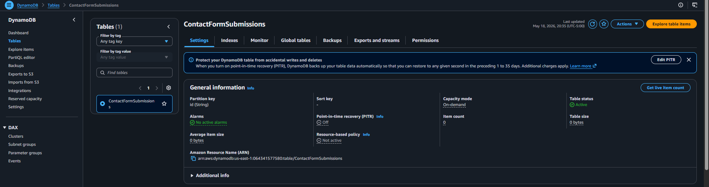

---

## Verifying Table Items

I then scanned the table for submitted records.

## Findings

The table returned zero items, confirming that Lambda was not successfully writing records into DynamoDB.

### Screenshot
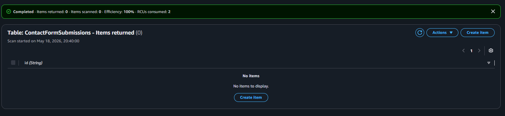

---

# Step 4: Verifying SNS Topic and Subscription

I reviewed the SNS topic configuration and subscription status.

## SNS Topic Verification

I verified:

```bash
Topic Name: ContactFormNotifications
Display Name: Contact Form
```

I also confirmed the SNS Topic ARN matched the environment variable configured inside Lambda.

### Screenshot
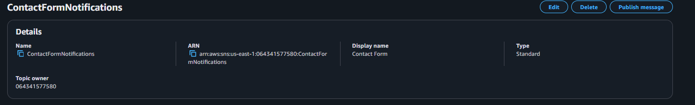

---

## Subscription Status Verification

I reviewed the SNS subscription details and confirmed the email subscription configuration.

## Findings

```bash
Protocol: Email
Endpoint: Configured email address
Status: Confirmed
```

Since I had already confirmed the SNS subscription earlier in the lab, email delivery issues would likely be related to Lambda execution failures rather than SNS subscription status.

### Screenshot
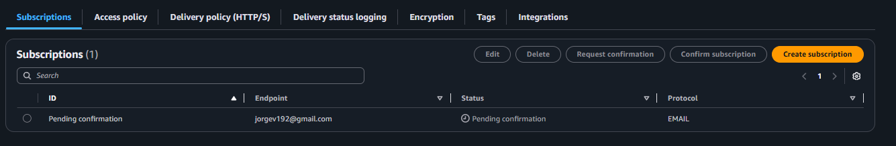

---

# Step 5: Analyzing IAM Role Permissions

Next, I reviewed the Lambda execution role permissions.

## Actions Performed

1. Opened Lambda Configuration → Permissions
2. Opened the IAM execution role
3. Reviewed attached policies

---

## Findings

The Lambda function only had the following managed policy attached:

```bash
AWSLambdaBasicExecutionRole
```

This policy only allowed:

- Writing logs to CloudWatch

The role was missing permissions for:

```bash
dynamodb:PutItem
sns:Publish
```

This confirmed the Lambda function lacked permissions required to:

- Write records into DynamoDB
- Publish notifications to SNS

### Screenshot
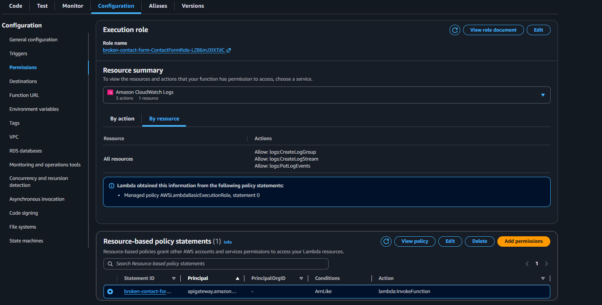

---

## Missing Permissions Identified

```bash
1. DynamoDB Permissions
   - Action: dynamodb:PutItem
   - Resource: ContactFormSubmissions table

2. SNS Permissions
   - Action: sns:Publish
   - Resource: ContactFormNotifications topic
```

---

# Step 6: Reviewing Lambda Dependencies

I returned to the Lambda function code to investigate dependency-related issues.

## Findings

Inside the code, I identified the following dependency:

```javascript
const { v4: uuidv4 } = require('uuid');
```

However, the `uuid` package was not included in the Lambda deployment package.

This directly matched the CloudWatch error:

```bash
Error: Cannot find module 'uuid'
```

### Screenshot


---

## Dependency Issue Summary

```bash
Dependency Issue:
The Lambda function requires the 'uuid' package,
but the dependency was not included in the deployment package.
```

---

# Step 7: Verifying Environment Variables

Next, I verified the Lambda environment variables.

## Findings

The following environment variable was correctly configured:

```bash
SNS_TOPIC_ARN
```

The ARN value matched the SNS topic configured earlier in the architecture.

This confirmed the issue was not related to Lambda environment variables.

### Screenshot
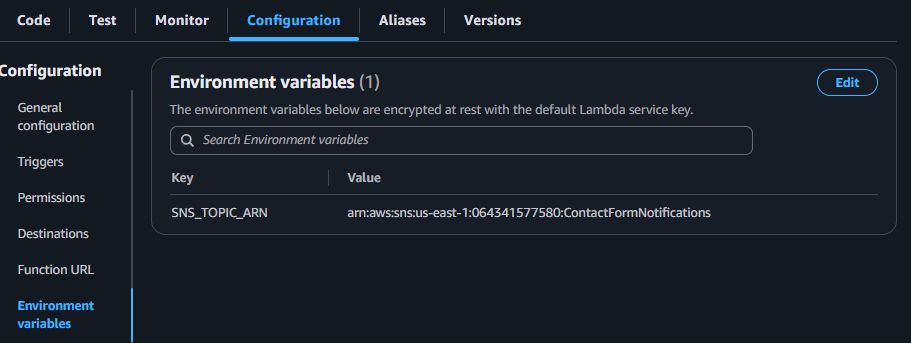

---

# Step 8: Creating a Full Architecture Issue Report

After verifying every component of the serverless workflow, I compiled a full architecture issue report.

## Contact Form Architecture Issue Report

```bash
1. API Gateway Configuration
   - Status: Correctly configured
   - Lambda integration working properly
   - API endpoint accessible

2. Lambda Function Code
   - Status: Dependency issue identified
   - Missing package: uuid
   - Impact: Lambda initialization failure

3. Lambda IAM Role
   - Status: Insufficient permissions identified
   - Only AWSLambdaBasicExecutionRole attached
   - No DynamoDB or SNS permissions configured
   - Potential Impact: Lambda cannot write to DynamoDB or publish to SNS

4. DynamoDB Table
   - Status: Correctly configured
   - No records inserted due to Lambda execution failure

5. SNS Topic and Subscription
   - Status: Correctly configured
   - Subscription already confirmed

6. Environment Variables
   - Status: Correctly configured
   - SNS_TOPIC_ARN value verified
```
---

# Next Steps

With all architecture issues successfully identified, the next phase will focus on applying fixes to restore full serverless functionality.

This includes:

- Fixing the missing Lambda dependency
- Updating IAM permissions
- Re-testing the API workflow
- Verifying DynamoDB writes
- Confirming SNS notification delivery

---

# 4.6 Applying Fixes to Restore Functionality

## Introduction

In this section, I applied fixes to resolve the issues identified during the investigation phase and restore the full functionality of the serverless contact form workflow.

The troubleshooting process involved:

- Fixing IAM permission issues
- Resolving the missing Lambda dependency
- Verifying SNS configuration
- Testing the complete serverless workflow end-to-end

By systematically addressing each issue, I was able to successfully restore communication between API Gateway, Lambda, DynamoDB, and SNS. 

---

# Step 1: Fixing IAM Permission Issues

The first issue I addressed involved missing IAM permissions for the Lambda execution role.

## Actions Performed

1. Opened the IAM Console
2. Located the Lambda execution role:

```bash
broken-contact-form-ContactFormRole
```

3. Clicked:

```bash
Add permissions → Create inline policy
```

4. Added permissions for:
   - DynamoDB `PutItem`
   - SNS `Publish`

---

## IAM Policy Added

```json
{
  "Version": "2012-10-17",
  "Statement": [
    {
      "Effect": "Allow",
      "Action": [
        "dynamodb:PutItem"
      ],
      "Resource": "arn:aws:dynamodb:us-east-1:064341577580:table/ContactFormSubmissions"
    },
    {
      "Effect": "Allow",
      "Action": [
        "sns:Publish"
      ],
      "Resource": "arn:aws:sns:us-east-1:064341577580:ContactFormNotifications"
    }
  ]
}
```

This policy granted Lambda the exact permissions required to:

- Write records into DynamoDB
- Publish messages to SNS

### Screenshot
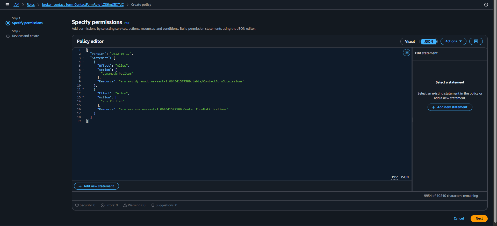

---

# Step 2: Verifying SNS Subscription

Next, I verified the SNS subscription status to ensure notifications could be delivered successfully.

## Findings

The SNS subscription had already been confirmed earlier during the lab setup process.

I verified that the subscription status displayed:

```bash
Confirmed
```

This confirmed SNS was fully configured to send email notifications successfully.

### Screenshot
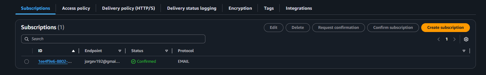

---

# Step 3: Fixing the Lambda Dependency Issue

The next issue involved the missing `uuid` package dependency inside the Lambda function.

## Original Code

```javascript
const { v4: uuidv4 } = require('uuid');
```

CloudWatch Logs previously showed:

```bash
Error: Cannot find module 'uuid'
```

---

## Solution Implemented

Instead of relying on an external package, I replaced the dependency with a custom UUID generator function.

## Updated Lambda Code

```javascript
const uuidv4 = () => {
  return 'xxxxxxxx-xxxx-4xxx-yxxx-xxxxxxxxxxxx'.replace(/[xy]/g, function(c) {
    const r = Math.random() * 16 | 0;
    const v = c === 'x' ? r : (r & 0x3 | 0x8);
    return v.toString(16);
  });
};
```

This removed the external dependency while maintaining UUID generation functionality. 

### Screenshot
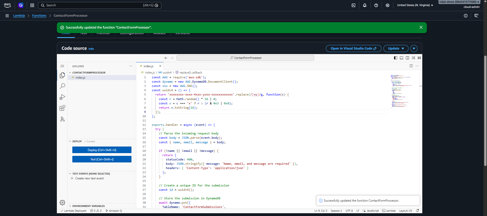

---

# Step 4: Deploying Lambda Code Changes

After updating the Lambda function code:

1. Clicked:

```bash
Deploy
```

2. Confirmed the deployment completed successfully

This published the updated Lambda code and made the changes active for future API requests.

### Screenshot


---

# Step 5: Updating Lambda Timeout Settings

To improve reliability, I increased the Lambda timeout configuration.

## Actions Performed

1. Opened:

```bash
Configuration → General configuration
```

2. Increased timeout value from:

```bash
3 seconds → 15 seconds
```

3. Saved the updated configuration

This ensured Lambda had enough execution time to:

- Write data into DynamoDB
- Publish SNS notifications


### Screenshot
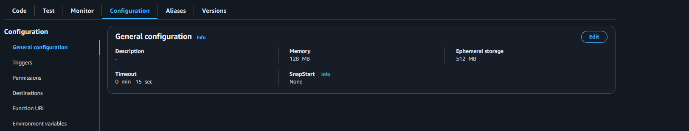

---

# Step 6: Testing the Fixed Workflow

After applying all fixes, I tested the full workflow again through API Gateway.

## Test Payload Used

```json
{
  "name": "Test User",
  "email": "test@example.com",
  "message": "This is a test message from API Gateway console"
}
```

---

## API Gateway Results

The API request completed successfully and returned:

```bash
Status Code: 200 OK
```

This confirmed the Lambda function was now processing requests successfully.

### Screenshot
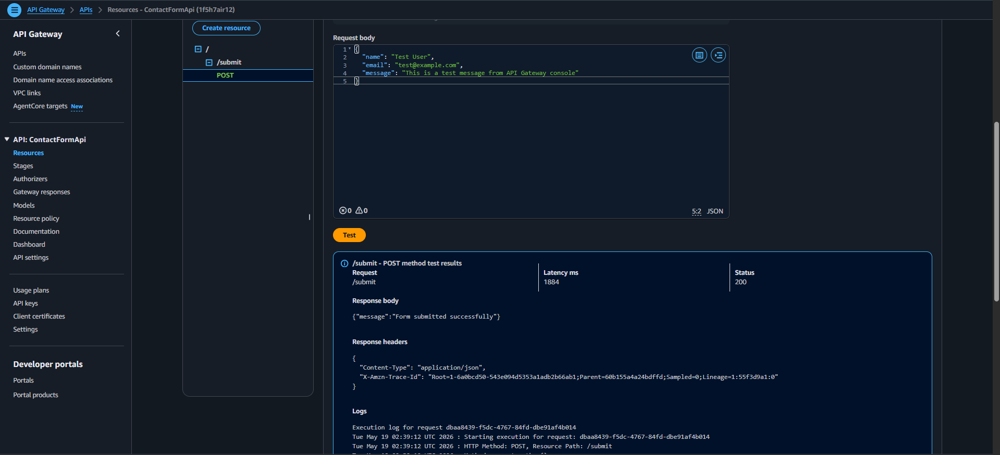

---

# Step 7: Verifying DynamoDB Records

Next, I verified that the form submission data was successfully written into DynamoDB.

## Findings

Inside the `ContactFormSubmissions` table, I confirmed:

- A new record was created
- UUID values were generated correctly
- Timestamp values were populated
- User submission data was stored successfully

This confirmed the IAM permission fix and UUID solution were working correctly. 

### Screenshot
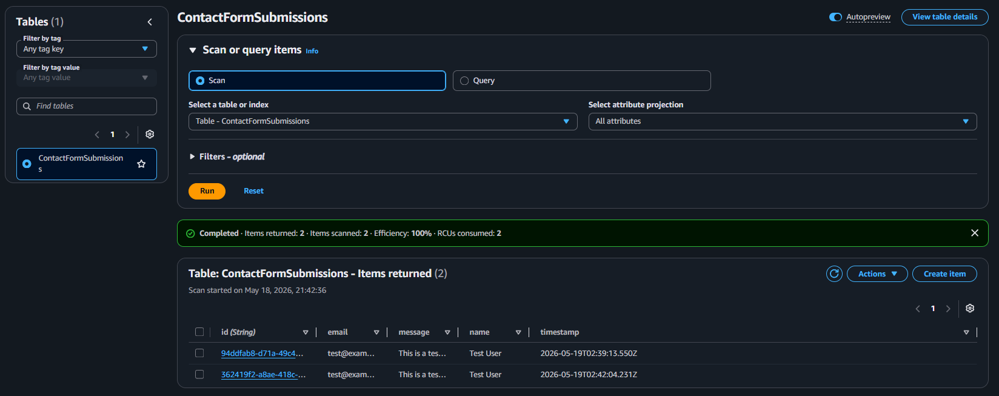

---

# Step 8: Verifying SNS Email Notifications

Finally, I verified that SNS notifications were successfully delivered.

## Findings

I received a new email notification containing:

- Name
- Email address
- Message content

from the test contact form submission.

This confirmed the SNS publish permissions and subscription configuration were functioning correctly. 

### Screenshot
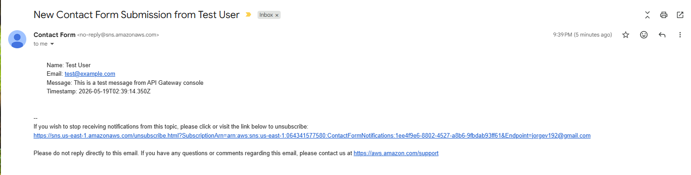


---

# Understanding What Was Fixed

This troubleshooting exercise demonstrated several common issues found in AWS serverless architectures.

## Issues Resolved

```bash
1. IAM Permission Issues
   - Added DynamoDB PutItem permission
   - Added SNS Publish permission

2. Lambda Dependency Issues
   - Removed external uuid package dependency
   - Implemented custom UUID generation

3. SNS Configuration
   - Verified email subscription confirmation

4. Lambda Timeout Configuration
   - Increased execution timeout for reliability
```

These fixes successfully restored full communication between all AWS services in the architecture.

---

# Final Result

After completing all fixes and validation testing, the serverless contact form workflow was fully restored.

## Fully Working Components

```bash
✓ API Gateway receives requests successfully
✓ Lambda processes submissions correctly
✓ DynamoDB stores contact form records
✓ SNS sends email notifications
✓ CloudWatch logs show successful execution
```

This project provided hands-on experience troubleshooting and restoring a production-style AWS serverless application.

---

# Project Summary

In this project, I successfully diagnosed and fixed a broken serverless contact form application, gaining hands-on experience troubleshooting AWS services in a real-world cloud support scenario.

Throughout the investigation, I analyzed service integrations, identified root causes, and restored full functionality across the serverless architecture.

---

# Key Achievements

```bash
✓ Identified and resolved multiple failure points across a serverless stack
✓ Applied diagnostic techniques using CloudWatch Logs and IAM analysis
✓ Fixed IAM permission issues and Lambda dependency problems
✓ Verified complete data flow between API Gateway, Lambda, DynamoDB, and SNS
✓ Restored full end-to-end functionality of the contact form workflow
```

---

# Key Skills Developed

```bash
✓ AWS service integration in serverless architectures
✓ Least-privilege IAM policy implementation
✓ CloudWatch log analysis and troubleshooting
✓ Lambda dependency management
✓ End-to-end testing across cloud services
✓ Serverless workflow debugging and validation
```
---
